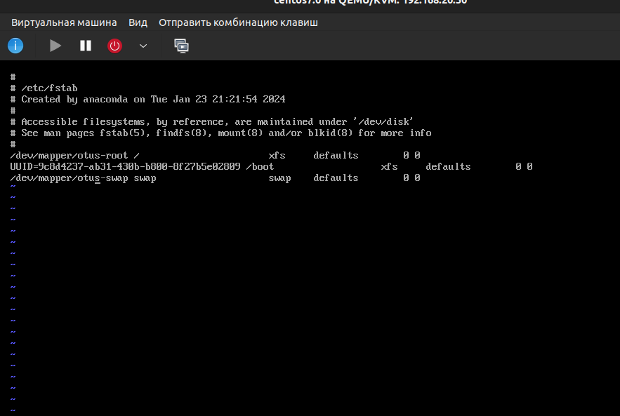

# Домашнее задание: работа с загрузчиком

## Попадаем в систему без пароля несколькими способами

Будем загружать ОС АЛЬТ.

При загрузке нажимаем `e` 

### Способ 1. init=/bin/sh:

В конце строки, начинающейся с `linux` добавляем init=/bin/bash 

и нажимаем `F10` для загрузки в систему.

Проверяем, что создать файл невозможно, т.к. файловая система примонтирована в режиме только для чтения.
Вводим команду `mount / rw,remount` для перемонтирования системного диска в режиме записи.
Проверяем, что создать файл возможно.

### Способ 2. rd.break:

Теперь в конце строки, которая начинается с `linux`, дописываем `rd.break`.

и нажимаем `F10` для загрузки в систему.
Альт Линукс загрузился в обычном режиме. Пока не понятно, почему.
Попробуем с CentOS:

Получилось:

`touch /.autorelabel ` было нужно для из-за того, что в Centos SElinux включен и надо, чтобы при перезагрузке этот самый relable выполнился.
Загружаемся с новым паролем и пробуем стать рутом с новым паролем. Работает.

### Способ 3. rw init=/sysroot/bin/sh

В строке, начинающейся с `linux` заменяем `ro` на `rw` `init=/sysroot/bin/sh` и нажимаем сtrl-x для загрузки в систему.

Загрузились:

Поменяем название `VolumeGroup` LVM.
Для этого:
1. Создадим каталог /tmp/test
2. Примонтируем туда /dev/mapper/centos/root
3. Примонтируем mount --bind /dev в /tmp/test/dev, аналогично сделаем то же для /sys и /proc
4. Сделаем chroot в /tmp/test
5. Посмотрим vgs

Меняем название с помощью vgrename centos otus, исправляем /etc/fstab так:

Далее вносим исправления в /etc/default/grub, заменяя `centos`на `otus`.

А вот для того, чтобы исправить /boot/grub2/grub.cfg пришлось примонтироваро /dev/vda1 в /boot, поскольку /boot в моём случае находился на другом разделе.

Пересоздаём initrd image и перезагружаемся. Получилось:

### Добавляем модуль с помощью dracut

Создаём папку `01test` в `/usr/lib/dracut/modules.d`, а в ней скрипты.

Запускаем `dracut -f -v` и проверяем результат:

Перезагружаемся и видим:

